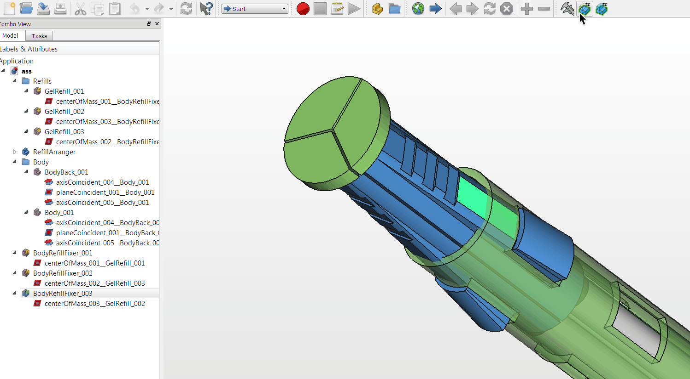

# FreeCAD macros for local view

Macros for toggle visibility unselected objects using spreadsheets for storing data and filter status. Ghost filter applies on enter local view state.

* `MKLocalView_LocalViewToggle.FCMacro` - toggles local view, unselected objects will be hided, after next run - restored (main macro)
* `MKLocalView_GhostFilterToggle.FCMacro` - ghost filter switch macro, unselected objects will be transparent on next local view toggle.

## Features

* Multiple selection
* Any hide'able object support
* Initial object properties stored in spreadsheet

## Demo

